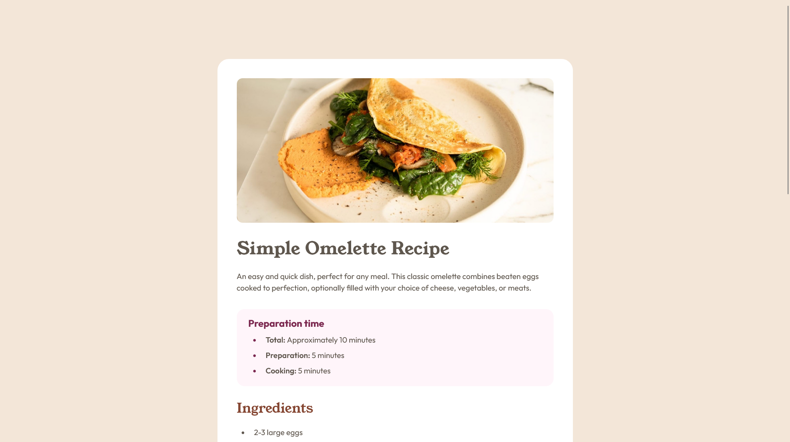

# Frontend Mentor - Recipe page solution

This is a solution to the [Recipe page challenge on Frontend Mentor](https://www.frontendmentor.io/challenges/recipe-page-KiTsR8QQKm). Frontend Mentor challenges help you improve your coding skills by building realistic projects. 

## Table of contents

- [Overview](#overview)
  - [Screenshot](#screenshot)
  - [Links](#links)
- [My process](#my-process)
  - [Built with](#built-with)
  - [What I learned](#what-i-learned)
  - [Continued development](#continued-development)
  - [Useful resources](#useful-resources)
- [Author](#author)

## Overview

### Screenshot



### Links

- Solution URL: [Github repository](https://github.com/marcorios-g/frontendmentor_recipe-page)
- Live Site URL: [Github live page](https://marcorios-g.github.io/frontendmentor_recipe-page/)

## My process

### Built with

- Semantic HTML5 markup
- CSS custom properties
- Flexbox
- Mobile-first workflow
- [SASS](https://sass-lang.com/)

### What I learned

I learned some techniques on how to stylize or skip specific elements without applying classes on HTML, as well as stylize the marker on the list items. Some of my favourite snippets are:

```css
&:not(:last-child, header, .preparation) {
        border-bottom: 1px solid var(--c-neutral-light_gray);
        padding-bottom: var(--s-32);
    }
```
```css
li::marker {
        color: var(--c-primary-dark_raspberry);
    }
```
```css
li:not(:last-child) {
        margin-bottom: var(--s-8);
    }

    li::marker:not(ol > li) {
        color: var(--c-primary-nutmeg);
        width: .25rem;
        font-size: .75rem;
    }
```

### Continued development

I want to continue learning how to build semantic and responsive tables, since that is an area I don't have much experience. Also I want to continue applying pseudo-classes and pseudo-elements when possible.

### Useful resources

- [Semantic heading tags](https://vid.puffyan.us/watch?v=NexL5_Vdoq8) - I regularly visit Kevin Powell's channel when I have questions about building semantic and accessible pages.
- [Stylizing list marker](https://stackoverflow.com/questions/7990429/how-to-control-size-of-list-style-type-disc-in-css) - I learned that the list marker can be stylized with the ::marker pseudo-element.
- [Exclude last child](https://www.geeksforgeeks.org/css-notlast-childafter-selector/) - A quick pseudo-class to exclude the last list item, instead of adding flex, direction and gap.
- [Border-bottom to table row](https://stackoverflow.com/questions/10040842/add-border-bottom-to-table-row-tr)
- [Padding to table cells](https://stackoverflow.com/questions/3656615/padding-a-table-row)

## Author

- Frontend Mentor - [@marcorios-g](https://www.frontendmentor.io/profile/marcorios-g)
- Github - [@marcorios-g](https://github.com/marcorios-g)